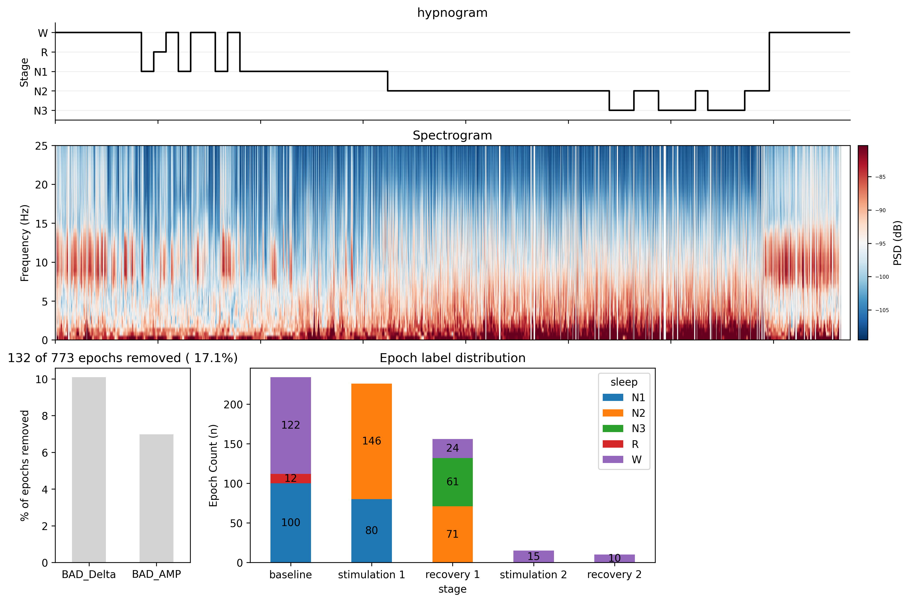
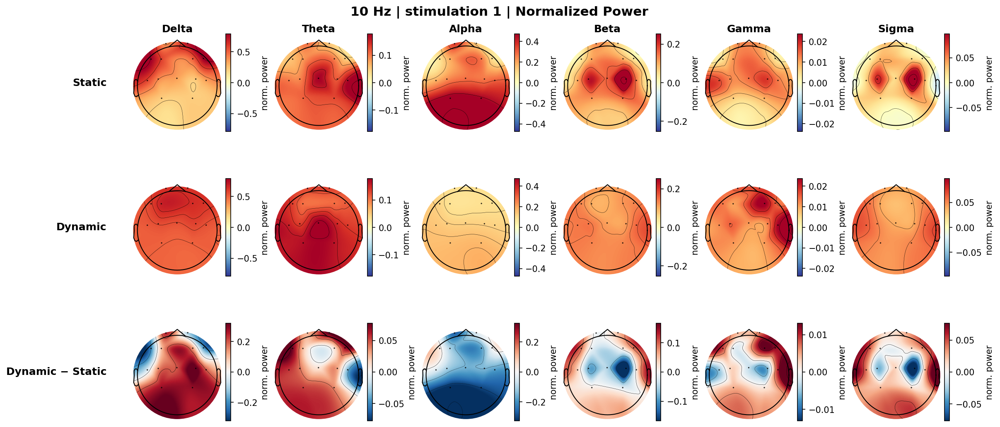
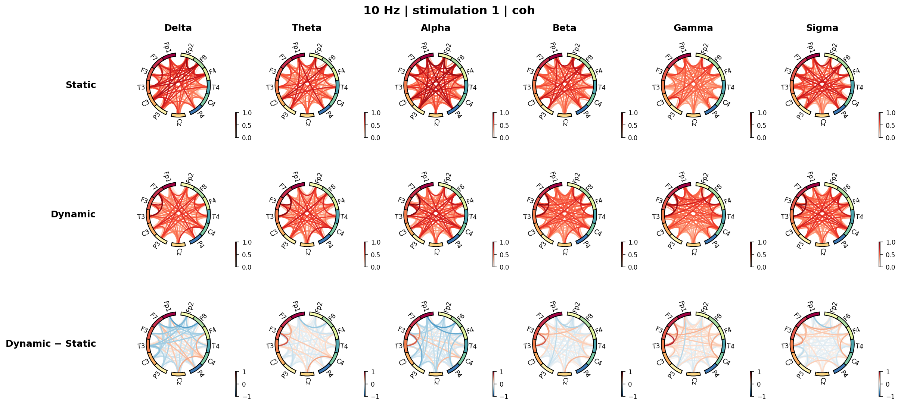
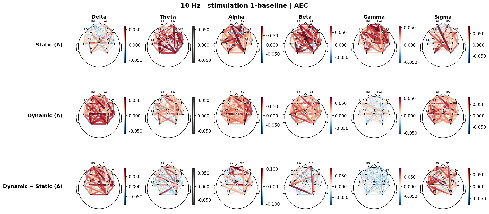

# Various tVNS Stimulation Recipes

EEG analysis notebook exploring how different **transcutaneous Vagus Nerve Stimulation (tVNS)** parameters affect brain activity.

This repository also serves as a practical usage example for [`eeg_utils`](./eeg_utils), a personal Python utility package for EEG processing and analysis.

---

## Experimental Design

**Stimulation frequency:** 5 / 10 / 20 / 25 / 40 Hz
**Stimulation type:**
- `dynamic` — 30 sec on / 15 sec off cycle
- `static` — continuous stimulation

**Phases per recording:**
| Phase | Duration |
|---|---|
| Baseline | 10 min |
| Stimulation 1 | 10 min |
| Recovery 1 | 10 min |

Each subject contributed one frequency condition (both dynamic and static).

---

## Repository Structure

```
various_tVNS_recipes/
├── different_recipe.ipynb   # Main analysis notebook
├── eeg_utils/               # Submodule — EEG utility package
├── Data/                    # Raw/processed EEG files + per-session preprocessing figures
└── figures/                 # Output figures (power topomaps, FC circle plots, etc.)
```

---

## Analysis Pipeline & `eeg_utils` Usage

### 1. Data Loading

CSV recordings are converted to MNE `Raw` format using `csv_to_raw()`.

```python
from eeg_utils.eeg_io import csv_to_raw

raw = csv_to_raw("Data/10hz_dynamic.csv")
raw.save("Data/10hz_dynamic_raw.fif")
```

---

### 2. Preprocessing

`EEG_Preprocessor` handles filtering and re-referencing via a fluent chaining API.
`preprocess_raw()` runs bad channel interpolation, bad segment annotation, ICA, sleep staging, and epoching end-to-end.
`plot_info()` produces a summary figure per session.

```python
from eeg_utils.eeg_preprocess import EEG_Preprocessor, preprocess_raw, plot_info

# Bandpass + notch filter → average re-reference
pp = (EEG_Preprocessor(raw)
      .bandpass_filter(source="orig", target="filt", l_freq=0.5, h_freq=50, notch_freq=60)
      .re_referencing(source="filt", target="ref", reref="average"))
raw_filt = pp.raw_ref

# Full pipeline: ICA, bad segments, sleep staging, epoching
raw_fin, epochs, hyp_up, apply_ica = preprocess_raw(raw_filt, bads=["F4", "C4"],
                                                     save_raw_path="..._raw_fin.fif",
                                                     save_epo_path="..._epo.fif")

fig, axes = plot_info(raw_fin, epochs, hyp_up, apply_ica)
```

**`plot_info()` output** — hypnogram, spectrogram, bad epoch summary, and epoch stage distribution:



---

### 3. Power Analysis

`PSDAnalyzer` computes normalized band power per channel.
`plot_topo()` renders MNE topographic maps.

```python
from eeg_utils.eeg_analysis import PSDAnalyzer
from eeg_utils.viz import plot_topo

freqs_bands = {'Delta': (0.5, 4), 'Theta': (4, 8), 'Alpha': (8, 12),
               'Beta': (12, 30), 'Gamma': (30, 45), 'Sigma': (12, 15)}

ep = epochs["stage == 'stimulation 1'"]
ana = PSDAnalyzer(ep)
norm_bp = ana.compute_band_power(bands=freqs_bands, cal='norm')

# Plot topomap for one band
plot_topo(norm_bp["Alpha"].values, info, vlim=(-0.5, 0.5), cmap='RdYlBu_r')
```

**Normalized power topomap** — Static / Dynamic / Dynamic−Static, per frequency band (10 Hz | Stimulation 1):



**Change from baseline (Δ)** — same layout but each row shows the shift from the baseline period:

---

### 4. Functional Connectivity Analysis

`EEG_Epocher` creates fixed-length epochs from continuous raw data for FC computation.
`FCAnalyzer` computes spectral FC (Coherence, PLV, PLI, wPLI) and AEC.
`plot_FC_topo()` overlays connectivity on a topomap; circle plots use `mne_connectivity`.

```python
from eeg_utils.eeg_preprocess import EEG_Epocher
from eeg_utils.eeg_analysis import FCAnalyzer

# Short epochs for spectral FC
epocher = EEG_Epocher(raw_fin).make_epochs(epoch_len=10.0, overlap=5.0, verbose=False)
ep = epocher.epochs["stage == 'stimulation 1'"].pick('eeg')

fc = FCAnalyzer(epochs=ep)
fc.compute_spectral_FC(method="coh", fmin=0.5, fmax=45)

# Longer epochs for AEC
epocher_aec = EEG_Epocher(raw_fin).make_epochs(epoch_len=20.0, overlap=0.0, verbose=False)
ep_aec = epocher_aec.epochs["stage == 'stimulation 1'"].pick('eeg')
fc_aec = FCAnalyzer(epochs=ep_aec)
fc_aec.compute_AEC(fmin=0.5, fmax=45)
```

**FC circle plot — Coherence** (10 Hz | Stimulation 1 | Static / Dynamic / Dynamic−Static, per band):



**Delta FC topomap — AEC (Δ from baseline)** — connectivity strength change during stimulation vs. baseline, comparing static and dynamic:



---

## Dependencies

All core dependencies are inherited from [`eeg_utils`](./eeg_utils/README.md):

```
mne, mne-connectivity
numpy, scipy, pandas
matplotlib, seaborn
yasa, fooof, pactools
scikit-learn, statsmodels
```